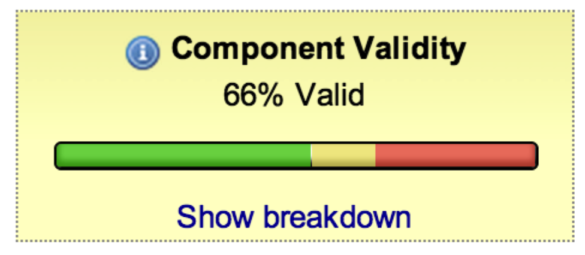
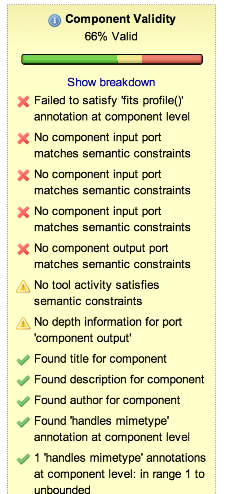

# Component validator

<!--
           Licensed to the Apache Software Foundation (ASF) under one
           or more contributor license agreements.  See the NOTICE file
           distributed with this work for additional information
           regarding copyright ownership.  The ASF licenses this file
           to you under the Apache License, Version 2.0 (the
           "License"); you may not use this file except in compliance
           with the License.  You may obtain a copy of the License at
            
             http://www.apache.org/licenses/LICENSE-2.0
            
           Unless required by applicable law or agreed to in writing,
           software distributed under the License is distributed on an
           "AS IS" BASIS, WITHOUT WARRANTIES OR CONDITIONS OF ANY
           KIND, either express or implied.  See the License for the
           specific language governing permissions and limitations
           under the License.
-->

The Taverna Component Validator is a tool and library for checking whether a 
   [Taverna Component](/documentation/components) satisfies the component profile defined by the family of which it is a member. 
It applies a number of checks to the component such that when they are all satisfied, 
   the component can be considered to be a high-quality member of the component family, 
   and provides human-readable descriptions of the conditions that are checked and whether they were satisfied or not.

We currently have the validator deployed on 
   [myExperiment.org](http://www.myexperiment.org) as an integrated feature of the metadata displayed about components.

